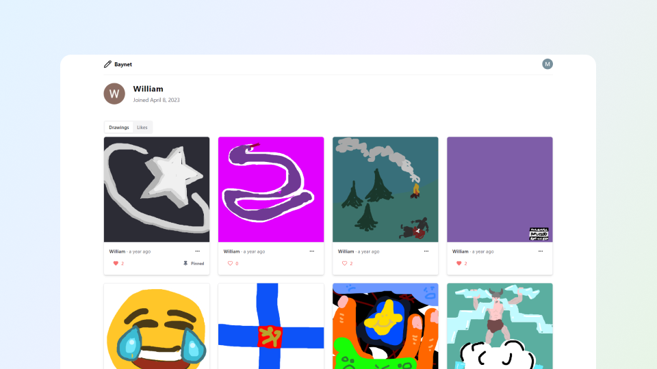

<div align="center">
  
  <h1>Baynet</h1>
  <a href="https://github.com/WilliamTuominiemi/NFT-Art-Platform/actions">
    
  </a>
  <a href="https://github.com/WilliamTuominiemi/NFT-Art-Platform/commits/main">
    
  </a>
  <a href="https://github.com/WilliamTuominiemi/NFT-Art-Platform/network/members">
    
  </a>
  <a href="https://github.com/WilliamTuominiemi/NFT-Art-Platform/stargazers">
    
  </a>
  <a href="https://github.com/WilliamTuominiemi/NFT-Art-Platform/issues/">
    
  </a>
  <a href="https://github.com/WilliamTuominiemi/NFT-Art-Platform/blob/main/LICENSE">
    
  </a>
</div>

### Screenshot

<a href="https://baynet.vercel.app">
  
</a>

### Get started

```bash
git clone https://github.com/MaximilianHagelstam/cryptochimp
cd cryptochimp

# Create a .env file in the root of the project and fill it out as per .env.example

npm install
npm run db:push
npm run dev
```

### Tech stack

CryptoChimp is built with the [T3 Stack](https://create.t3.gg), which includes the following technologies:

- [Next.js](https://nextjs.org)
- [TypeScript](https://www.typescriptlang.org)
- [tRPC](https://trpc.io)
- [NextAuth.js](https://next-auth.js.org)
- [Prisma](https://prisma.io)
- [PlanetScale](https://planetscale.com/)
- [Tailwind CSS](https://tailwindcss.com)
