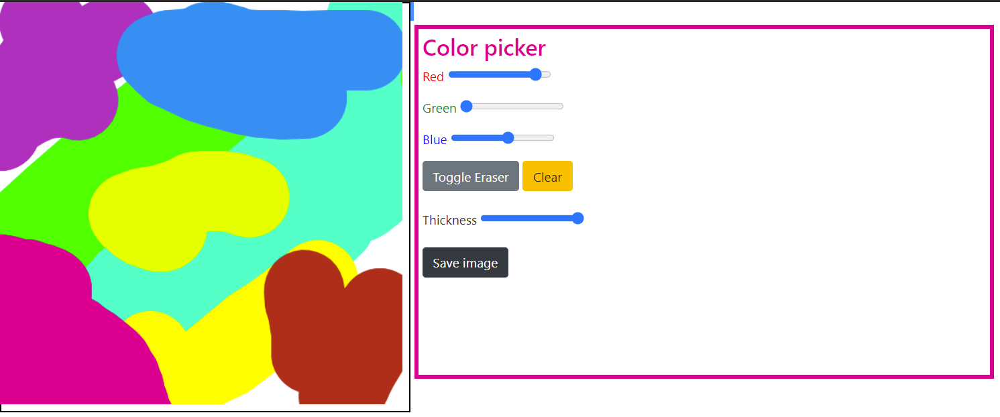

# BayyNet NFT art platform

    <a href="#About">About</a> •
    <a href="#Features">Features</a> •
    <a href="#Installation">Installation</a> •
    <a href="#My-socials">My socials</a>

## About

A NFT-art marketplace where you can create new NFTs and trade them with others. Trades are added to a blockchain for increased security. Visit the website here: https://bayynet.herokuapp.com/

## Features

### Drawing

Draw drawings and dave them to your profile. Drawings are saved on the database as Base64 strings.

### Trading

Trade drawings you own with other users.

### Blockchain

Basic ledger that saves information about the trade transactions.

## Installation

1. install [Node.js](https://nodejs.org/en/)
2. download project zip
3. extract the project folder and open it in a terminal
4. Set up Google credentials
5. Fill out .env according to example env
6. run `npm install` and `node index` in the project directory
7. open "localhost:3000" in browser

## My socials

-   :email: Email: william.m.tuominiemi@gmail.com
-   :link: Github: https://github.com/WilliamTuominiemi
